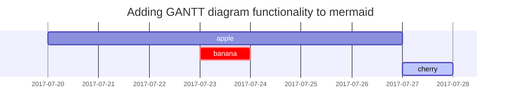

This post is to show Markdown syntax rendering on [**Chirpy**](https://github.com/cotes2020/jekyll-theme-chirpy/fork), you can also use it as an example of writing. Now, let's start looking at text and typography.

## Titles 제목
---
# H1 - heading 헤딩

<h2 data-toc-skip>H2 - heading 헤딩</h2>

<h3 data-toc-skip>H3 - heading 헤딩</h3>

<h4>H4 - heading 헤딩</h4>

---

## Paragraph 파라그래프

Quisque egestas convallis ipsum, ut sollicitudin risus tincidunt a. Maecenas interdum malesuada egestas. Duis consectetur porta risus, sit amet vulputate urna facilisis ac. Phasellus semper dui non purus ultrices sodales. Aliquam ante lorem, ornare a feugiat ac, finibus nec mauris. Vivamus ut tristique nisi. Sed vel leo vulputate, efficitur risus non, posuere mi. Nullam tincidunt bibendum rutrum. Proin commodo ornare sapien. Vivamus interdum diam sed sapien blandit, sit amet aliquam risus mattis. Nullam arcu turpis, mollis quis laoreet at, placerat id nibh. Suspendisse venenatis eros eros.

감또개 감사합니다 우리는 다솜 로운 다솜 미쁘다 미리내 여우별 노트북 책방 여우별 감사합니다 소솜 여우비 사과 감사합니다 가온해 달볓 여우별 별하 곰다시 포도 별빛 안녕 별빛 포도 사과 늘품 나비잠 로운 안녕 도르레 곰다시 도르레 산들림 여우비 그루잠 늘품 미리내 비나리 도서 노트북 가온누리 아리아 곰다시 감사합니다 늘품 비나리 가온누리.

## Lists 리스트

### Ordered list

1. Firstly 첫 번째
2. Secondly 두 번째
3. Thirdly 세 번째

### Unordered list

- Chapter 챕터
  + Section 섹션
    * Paragraph 파라그래프

### ToDo list

- [ ] Job 태스크
  + [x] Step 1 스텝1
  + [x] Step 2 스텝2
  + [ ] Step 3 스텝3

### Description list

Sun
: the star around which the earth orbits

Moon
: the natural satellite of the earth, visible by reflected light from the sun

## Block Quote 블락 퀏

> This line shows the _block quote_.

## Prompts 프롬프트

> An example showing the `tip` type prompt. 프롬프트1
{: .prompt-tip }

> An example showing the `info` type prompt. 프롬프트2
{: .prompt-info }

> An example showing the `warning` type prompt.
{: .prompt-warning }

> An example showing the `danger` type prompt.
{: .prompt-danger }

## Tables 테이블

| Company                      | Contact          | Country |
|:-----------------------------|:-----------------|--------:|
| Alfreds Futterkiste          | Maria Anders     | Germany |
| Island Trading               | Helen Bennett    | UK      |
| Magazzini Alimentari Riuniti | Giovanni Rovelli | Italy   |

## Links 링크

<http://127.0.0.1:4000>

## Footnote 풋노트

Click the hook will locate the footnote[^footnote], and here is another footnote[^fn-nth-2].

## Inline code 인라인 코드

This is an example of `Inline Code`.

## Filepath 파일패스

Here is the `/path/to/the/file.extend`{: .filepath}.

## Code blocks 코드 블럭

### Common

```
This is a common code snippet, without syntax highlight and line number.
```

### Specific Language

```bash
if [ $? -ne 0 ]; then
  echo "The command was not successful.";
  #do the needful / exit
fi;
```

### Specific filename

```sass
@import
  "colors/light-typography",
  "colors/dark-typography"
```
{: file='_sass/jekyll-theme-chirpy.scss'}

## Mathematics 매스매틱스

The mathematics powered by [**MathJax**](https://www.mathjax.org/):

$$ \sum_{n=1}^\infty 1/n^2 = \frac{\pi^2}{6} $$

When $a \ne 0$, there are two solutions to $ax^2 + bx + c = 0$ and they are

$$ x = {-b \pm \sqrt{b^2-4ac} \over 2a} $$

## Mermaid SVG 머메이드



## Images 이미지

### Default (with caption)

{: width="972" height="589" }
_Full screen width and center alignment_

### Left aligned

{: width="972" height="589" .w-75 .normal}

### Float to left

{: width="972" height="589" .w-50 .left}
Praesent maximus aliquam sapien. Sed vel neque in dolor pulvinar auctor. Maecenas pharetra, sem sit amet interdum posuere, tellus lacus eleifend magna, ac lobortis felis ipsum id sapien. Proin ornare rutrum metus, ac convallis diam volutpat sit amet. Phasellus volutpat, elit sit amet tincidunt mollis, felis mi scelerisque mauris, ut facilisis leo magna accumsan sapien. In rutrum vehicula nisl eget tempor. Nullam maximus ullamcorper libero non maximus. Integer ultricies velit id convallis varius. Praesent eu nisl eu urna finibus ultrices id nec ex. Mauris ac mattis quam. Fusce aliquam est nec sapien bibendum, vitae malesuada ligula condimentum.

### Float to right

{: width="972" height="589" .w-50 .right}
Praesent maximus aliquam sapien. Sed vel neque in dolor pulvinar auctor. Maecenas pharetra, sem sit amet interdum posuere, tellus lacus eleifend magna, ac lobortis felis ipsum id sapien. Proin ornare rutrum metus, ac convallis diam volutpat sit amet. Phasellus volutpat, elit sit amet tincidunt mollis, felis mi scelerisque mauris, ut facilisis leo magna accumsan sapien. In rutrum vehicula nisl eget tempor. Nullam maximus ullamcorper libero non maximus. Integer ultricies velit id convallis varius. Praesent eu nisl eu urna finibus ultrices id nec ex. Mauris ac mattis quam. Fusce aliquam est nec sapien bibendum, vitae malesuada ligula condimentum.

### Dark/Light mode & Shadow

The image below will toggle dark/light mode based on theme preference, notice it has shadows.

{: .light .w-75 .shadow .rounded-10 w='1212' h='668' }
{: .dark .w-75 .shadow .rounded-10 w='1212' h='668' }

## Video 비디오



## Reverse Footnote 리버스 풋노트

[^footnote]: The footnote source
[^fn-nth-2]: The 2nd footnote source
